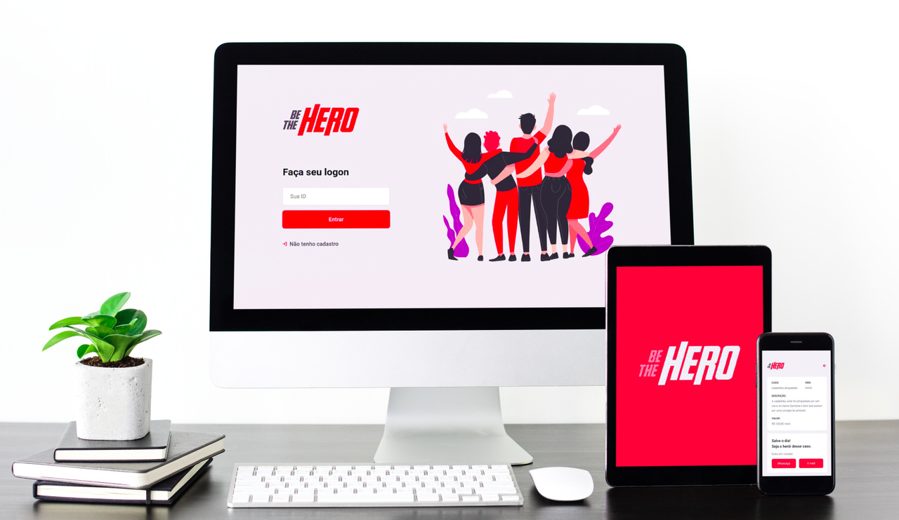

<h1 align="center">
    
</h1>

<h4 align="center">
  🚀 Semana OmniStack 11.0
</h4>

 

  

  <a href="#rocket-tecnologias">Tecnologias</a>&nbsp;&nbsp;&nbsp;|&nbsp;&nbsp;&nbsp;
  <a href="#-projeto">Projeto</a>&nbsp;&nbsp;&nbsp;|&nbsp;&nbsp;&nbsp;
  <a href="#-layout">Layout</a>&nbsp;&nbsp;&nbsp;|&nbsp;&nbsp;&nbsp;
  <a href="#-como-contribuir">Como contribuir</a>&nbsp;&nbsp;&nbsp;|&nbsp;&nbsp;&nbsp;
  <a href="#memo-licença">Licença</a>

 

## :rocket: Technologies

Technologies implemented in this project:

- [Node.js](https://nodejs.org/en/)
- [React](https://reactjs.org)
- [React Native](https://facebook.github.io/react-native/)
- [Expo](https://expo.io/)

## 💻 Project

BeTheHEro is a project aimed to connect donors with NGO's (non-governmental organizations ) in need. 

## 🔖 Layout

You can check the project's layout by [clicking here](https://www.figma.com/file/2C2yvw7jsCOGmaNUDftX9n/Be-The-Hero---OmniStack-11?node-id=37%3A394)
Você pode visualizar o layout do projeto no formato através [desse link](https://www.figma.com/file/2C2yvw7jsCOGmaNUDftX9n/Be-The-Hero---OmniStack-11?node-id=37%3A394). You need to be logged in on [Figma](http://figma.com/).

## :memo: Copyrights

This project is available under the MIT license. The file [LICENSE](LICENSE.md) has more details.

---

Feito com ♥ por Iury Melo:wave: [See you!](https://www.linkedin.com/in/iuryamerico/)
